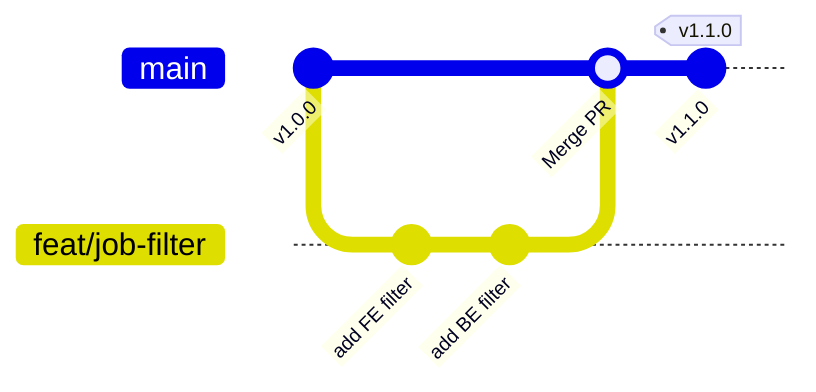

# 🍚 AI 밥그릇 (AI Trend & Playbook Platform)

AI 격변의 시대, 개발자들의 생존 가이드라인을 제시하고 실시간 AI 기술 소식 및 테크 블로그 뉴스를 수집/요약하여 제공하는 웹 대시보드 플랫폼입니다.

---

## 🖥️ 주요 기능

1. **Gemini AI 기반 실시간 리포트**: 수집된 최신 기사를 분석하여 일간/주간/월간 단위의 트렌드 요약 리포트를 자동으로 제공합니다.
2. **실시간 크롤링 IT 피드**: Hacker News, TechCrunch, Toss Tech, Kakao Tech 등 주요 IT/AI RSS 피드에서 수집된 기사들을 제공합니다.
3. **직무 태깅 및 필터링**: 수집된 뉴스를 정규 표현식 및 형태소 기반 엔진으로 분석하여 8대 개발 직무별로 자동 분류하여 필터링합니다.
4. **직무별 AI 생존 가이드북**: Frontend, Backend, DevOps, AI, Mobile, DBA, QA, Security 각 직무 맞춤형 실무 AI 플레이북 및 추천 로드맵 카드를 제공합니다.

---

## 📂 프로젝트 구조

```text
AI밥그릇/
├── .github/
│   ├── ISSUE_TEMPLATE/
│   │   ├── bug_report.md        # 버그 리포트 템플릿
│   │   └── feature_request.md   # 신규 기능 제안 템플릿
│   ├── workflows/
│   │   └── release.yml          # Git Tag 푸시 시 릴리즈 자동 생성 Workflow
│   └── pull_request_template.md # Pull Request 템플릿
├── __pycache__/                 # 파이썬 컴파일 캐시 (Git 제외)
├── assets/                      # 웹 애플리케이션 리소스 (이미지 등)
├── app.js                       # 대시보드 웹 애플리케이션 메인 로직
├── index.html                   # 대시보드 웹 메인 화면 (Glassmorphism 적용)
├── style.css                    # 대시보드 스타일 시트
├── crawler.py                   # IT/AI 뉴스 수집 및 Gemini 요약 엔진 (Python)
├── run_crawler.sh               # 크롤러 정기 실행 쉘 스크립트
├── crawled_data.js              # 크롤링 및 요약 완료된 프론트엔드 연동 데이터
├── data.js                      # 직무별 가이드북 로컬 데이터
├── VERSION                      # 프로젝트 현재 버전 정보
├── .gitignore                   # Git 관리 예외 설정 파일
├── 발표_시나리오_및_보고서.md      # 임원 발표 시나리오 문서
└── 상세_보고서.md                # 프로젝트 상세 기술 명세서
```

---

## ⚡ 실행 방법

### 1. 백엔드 크롤러 실행 (Python)
크롤러는 RSS 피드 수집과 Gemini AI 요약을 통해 `crawled_data.js`를 동적으로 생성합니다.

```bash
# 필수 라이브러리 설치 (필요시)
pip install google-generativeai

# API 키 설정
export GEMINI_API_KEY="your_api_key_here"

# 크롤러 실행
bash run_crawler.sh
```

### 2. 프론트엔드 웹 대시보드 구동
로컬 웹 서버를 띄워 대시보드 화면을 확인합니다.
```bash
# 예시: python 내장 서버 활용 (8088 포트 등)
python3 -m http.server 8088
```
웹 브라우저에서 `http://localhost:8088` 주소로 접속합니다.

---

## 🌿 브랜치 전략 (Branching Strategy - GitHub Flow)

본 프로젝트는 안정적인 main 브랜치 품질 유지와 수월한 공동 개발을 위해 가볍고 직관적인 **GitHub Flow** 브랜치 모델을 따릅니다.



### 1. 브랜치 명명 규칙 (Branch Naming Convention)
브랜치는 생성 목적에 따라 다음과 같이 일관되게 명명합니다.

* **`feat/기능내역`**: 새로운 기능 개발 (예: `feat/job-filter`)
* **`fix/버그내역`**: 버그 및 오류 수정 (예: `fix/broken-scroll`)
* **`docs/문서내역`**: 문서 작성 및 수정 (예: `docs/readme-update`)
* **`refactor/작업내역`**: 코드 구조 리팩토링 (예: `refactor/split-crawler`)

### 2. 개발 및 브랜치 병합 워크플로우

1. **신규 브랜치 생성**:
   `main` 브랜치가 최신 상태인지 확인하고, 새 작업을 진행할 브랜치를 생성합니다.
   ```bash
   git checkout main
   git pull origin main
   git checkout -b feat/new-feature
   ```
2. **커밋 작성**:
   작업 단위별로 의미 있는 커밋 메시지 규칙(Conventional Commits)을 준수해 커밋을 남깁니다.
3. **원격 푸시 및 Pull Request 생성**:
   작업이 완료되면 본인 브랜치를 GitHub에 푸시하고, PR 템플릿에 맞추어 Pull Request를 생성합니다.
   ```bash
   git push origin feat/new-feature
   ```
4. **리뷰 및 병합 (Merge)**:
   코드 리뷰 및 테스트 통과 후 `main` 브랜치에 병합합니다. (병합 후 원격/로컬의 `feat/new-feature` 브랜치는 삭제합니다.)

> [!TIP]
> **GitHub Branch Protection 설정 (추천)**
> GitHub 저장소 웹사이트의 **Settings > Branches > Branch protection rules** 메뉴에서 `main` 브랜치에 대해 `Require a pull request before merging` 규칙을 설정하면, 실수로 `main` 브랜치에 직접 Push하는 것을 방지하여 협업 안정성을 높일 수 있습니다.

---

## 🏷️ 버전 관리 및 GitHub 활용 가이드 (Versioning & Release)

### 1. 커밋 메시지 규칙 (Conventional Commits)
커밋을 남길 때는 아래 규격을 따릅니다. 이를 준수하면 GitHub Actions에서 릴리즈 노트를 깔끔하게 분류하여 자동 완성합니다.

| 타입 (Type) | 내용 | 예시 |
| :--- | :--- | :--- |
| `feat` | 새로운 기능 추가 | `feat: 직무 필터링에 QA 직무 추가` |
| `fix` | 버그 수정 | `fix: 모바일 환경에서 탭 터치 레이아웃 깨짐 수정` |
| `docs` | 문서 수정 (README, 시나리오 등) | `docs: README.md 버전 관리 규칙 업데이트` |
| `style` | 코드 포맷팅, 세미콜론 누락 등 (코드 동작 변경 없음) | `style: app.js 인덴트 정리` |
| `refactor` | 프로덕션 코드 리팩토링 | `refactor: crawler.py RSS 파싱 모듈 모듈화` |
| `chore` | 빌드 업무, 패키지 매니저 설정, 프로젝트 설정 등 | `chore: .gitignore에 임시 로그 경로 추가` |

### 2. 버전 릴리즈 프로세스 (Step-by-step)

새로운 기능을 배포하거나 버그를 수정하여 버전을 올리고자 할 때 아래 단계를 수행합니다.

1. **VERSION 파일 업데이트**:
   - 루트의 `VERSION` 파일 내용(예: `1.0.0`)을 올릴 버전(예: `1.1.0`)으로 수정합니다.
2. **변경 사항 커밋**:
   ```bash
   git add VERSION
   git commit -m "chore: release v1.1.0"
   ```
3. **버전 태그 생성**:
   - Git Tag를 로컬에 생성합니다. 버전 포맷은 `vX.Y.Z` 형태를 준수합니다.
   ```bash
   git tag v1.1.0
   ```
4. **GitHub로 푸시**:
   - 커밋과 함께 태그를 원격 저장소로 푸시합니다.
   ```bash
   git push origin main --tags
   ```
5. **자동 릴리즈 노트 생성 확인**:
   - 태그가 푸시되면 **GitHub Actions** 워크플로우가 자동으로 트리거됩니다.
   - GitHub Repository의 **Releases** 메뉴에 가보면, 커밋 메시지를 토대로 자동으로 구성된 릴리즈 노트와 함께 새로운 Release가 발행되어 있는 것을 확인할 수 있습니다.

---

* **PR 자동화 연동 테스트 완료**: 2026-07-01 14:49 (KST)

